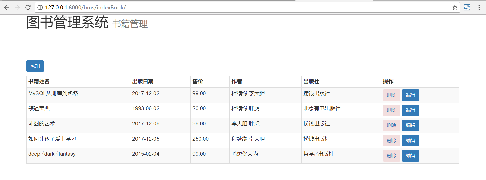
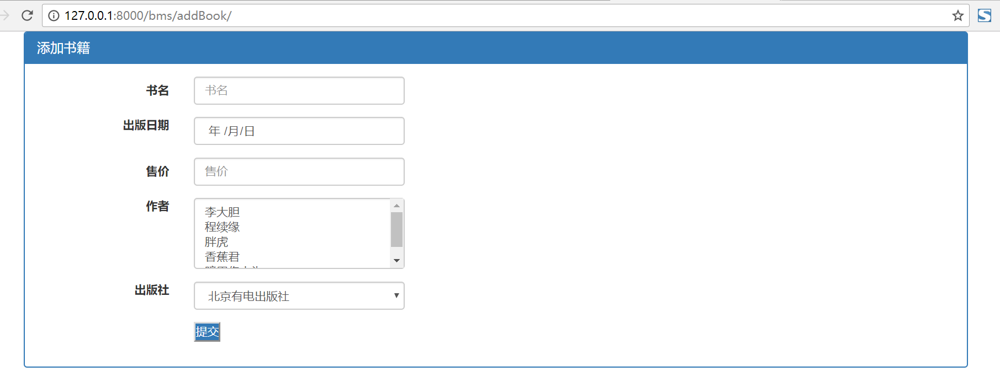
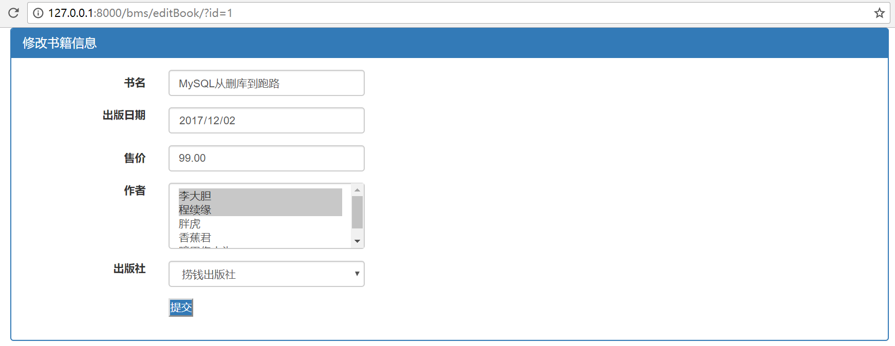
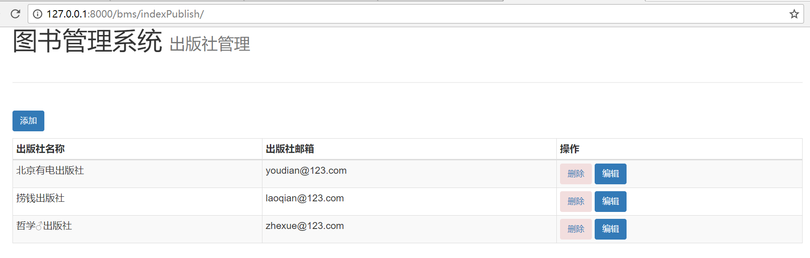
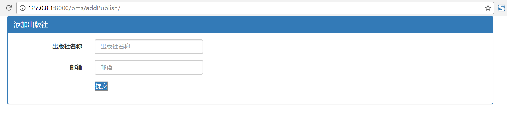
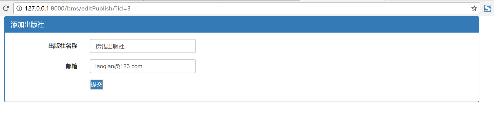
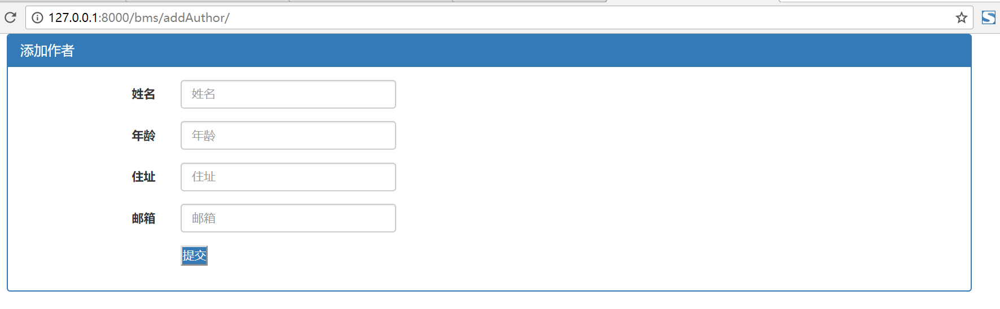
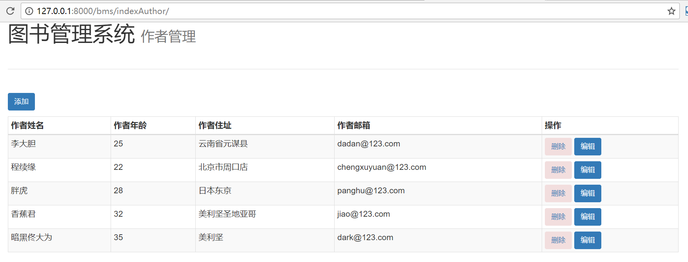

## 分析

- 一本书 可以由多个作者编著
- 一本书只能由一个出版社出版
- 一个作者可以写多本书
- 每个作者有自己的简介

**对应关系**：

- Author-Book # 多对多
- Publish-Book # 一对多
- Author-AuhtorDetail # 一对一

**如何创建**：

- 多对多：ManyToManyField
- 一对多：ForeignKey
- 一对一：OneToOneField

注意：创建一对多表的时候，ForeignKey建在多的那一方。另外两个随意建在哪一方。

## 目录结构


## 配置 settings.py

**注册app**:INSTALLED_APPS 项中添加bms

**配置静态文件**：

```
STATICFILES_DIRS = [
    os.path.join(BASE_DIR, 'bms', 'static')
]
```

**配置模板**：

TEMPLATES中添加：

```
'DIRS': [os.path.join(BASE_DIR, 'templates')]
```

**配置路由分发**

DjangoBMS.urls.py

```
from django.conf.urls import url,include
from django.contrib import admin
 
urlpatterns = [
    url(r'^admin/', admin.site.urls),
    url(r'^bms/', include('bms.urls')),
]
```

**配置母模**

```
<!DOCTYPE html>
<html lang="zh-CN">
<head>
    <meta charset="UTF-8">
    <meta http-equiv="X-UA-Compatible" content="IE=edge">
    <meta name="viewport" content="width=device-width, initial-scale=1, maximum-scale=1, user-scalable=no">
    <title>Title</title>
    <link rel="stylesheet" href="/static/plugins/bootstrap/css/bootstrap.min.css">

    <style>
        
            * {
                margin: 0;
                padding: 0;
            }
        
    </style>

<body>



<script src="/static/js/jquery-3.2.1.min.js"></script>
<script src="/static/plugins/bootstrap/js/bootstrap.min.js"></script>
<script>
    
    
</script>

</body>
</html>　
```

## 创建数据库表结构

bms.models.py

```
from django.db import models
 
 
class Publish(models.Model):
    # 出版社
    name = models.CharField(max_length=32)
    email = models.EmailField()
 
 
class AuhtorDetail(models.Model):
    # 作者简介
    addr = models.CharField(max_length=32)
    email = models.EmailField()
 
 
class Author(models.Model):
    # 作者
    name = models.CharField(max_length=32)
    age = models.IntegerField()
    detail = models.OneToOneField('AuhtorDetail')
 
 
class Book(models.Model):
    # 书籍
    title = models.CharField(max_length=32)
    publishDate = models.DateField()
    price = models.DecimalField(max_digits=5, decimal_places=2)  # 最大 999.99
    publish = models.ForeignKey('Publish')  # 一对多
    authors = models.ManyToManyField('Author')  # 多对多
```

生成表命令：

python manange.py makemigrations

python manage.py migrate


数据增删改查参考代码 0_o


效部分果图：

书籍管理



添加书籍



编辑书籍



出版社管理



添加出版社



编辑出版社



作者管理



添加作者


编辑作者




## 新增用户验证功能


### 创建超级用户
```
D:\PycharmProjects\DjangoBMS>python manage.py createsuperuser
Username (leave blank to use 'lcg'): lcg
Email address: lcgbeautiful@gmail.com
Password:
Password (again):
Superuser created successfully.

```

### 用于用户验证的装饰器
```
def check_login(func):
    def foo(request,*args,**kwargs):
        user = request.user
        if not user.is_authenticated():
            return redirect('/bms/loginbms/')        
        return func(request,*args,**kwargs)
    return foo
```